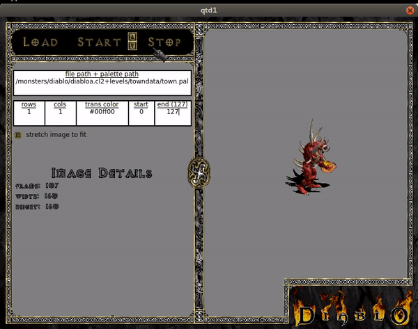

## Dependencies {#mainpage}
1. [Qt 4.8+](http://doc.qt.io/qt-4.8/)
2. [SDL Mixer 2.0+](https://www.libsdl.org/projects/SDL_mixer/)
3. [FFmpeg 2.8+](https://ffmpeg.org/download.html)
4. [zlib 1.2.8](https://www.zlib.net/)
5. [bzip2 1.0.6](http://www.bzip.org/downloads.html)
6. [doxygen 1.8.10+](http://www.stack.nl/~dimitri/doxygen/)
7. [StormLib](http://www.zezula.net/en/mpq/stormlib.html)
8. [Diablo 1 cd](https://www.amazon.com/s/ref=nb_sb_noss_2?url=search-alias%3Daps&field-keywords=diablo+1)

All dependencies can be acquired through the package manager in your favorite
Linux flavor. Build instructions are only provided for Ubuntu 16.04 currently.
Instructions for other flavors and other OSs will be provided in the future.

## Ubuntu 16.04 Build Instructions

### Install Dependencies
1. run `sudo apt-get install libqt4-dev libpng-dev`
2. run `sudo apt-get install libsdl2-mixer-dev`
3. run `sudo apt-get install libavcodec-dev libavformat-dev libswresample-dev libswscale-dev`
4. run `sudo apt-get install zlib1g-dev`
5. run `sudo apt-get install libbz2-dev`
6. run `sudo apt-get install doxygen`
7. run `sudo apt-get install libstorm-dev`
   - Note: If the stormlib package cannot be found go to [this](http://xpam.pl/blog/?p=117) website and follow the instructions for deb based distros.

Note: On Ubuntu 17.04 and up, libpng12.so is no longer available through
libpng-dev. To get access to this library, run the following lines:
* wget http://mirrors.kernel.org/ubuntu/pool/main/libp/libpng/libpng12-0_1.2.54-1ubuntu1_amd64.deb
* sudo dpkg -i libpng12-0_1.2.54-1ubuntu1_amd64.deb

### Build QtD1
1. Create a new directory to work in (e.g. run `mkdir qtd1`)
2. Move to the new directory (e.g. run `cd qtd1`)
3. Download the QtD1 source code: run `git clone git@github.com:seanrobinson1114/QtD1.git`
4. Create a build directory (e.g. run `mkdir build`)
5. Move to the build directory (e.g. run `cd build`)
6. Copy game assets (diabdat.mpq) and executable (Diablo.exe) from the Diablo 1
   cd to the build directory
7. configure qtd1: run `cmake -DCMAKE_INSTALL_PREFIX=../ ../QtD1`
8. build qtd1: run `make -j4`
9. build qtd1 manual: run `make manual`
10. run qtd1 tests: run `make test`
11. install qtd1: run `make install`

After successfully running all of these commands three new directories will be
present in the parent directory: doc, lib and bin. The doc directory contains
the API documentation, which can be loaded with a web browser. The lib
directory contains the compiled libraries. Finally, the bin directory contains
the qtd1 executable.

## Tools

### The QtD1 Image Viewer
To run the image viewer simply run `qtd1 --viewer`. There is currently
no drop-down menu for the image assets that can be loaded. To see what assets
are available, open up the mpq.ini file in the properties directory. The viewer
can load all pcx, cel and cl2 files (the cel and cl2 files also require a
palette). Check out the screen capture of the viewer tool below.

## Acknowledgements
This project would never have gotten off the ground without the great work from the [Freeablo](https://github.com/wheybags/freeablo) developers. We ultimately decided to go a different direction with the reimplementation of the Diablo 1 game engine by focusing heavily on Qt4.  

Special thanks must also be given to the [sanctuary](https://github.com/sanctuary) developers who created the [blizzconv](https://github.com/mewrnd/blizzconv) library. The thorough documentation of the cel, cl2, min, til, dun and sol decoders was extremely helpful. 
